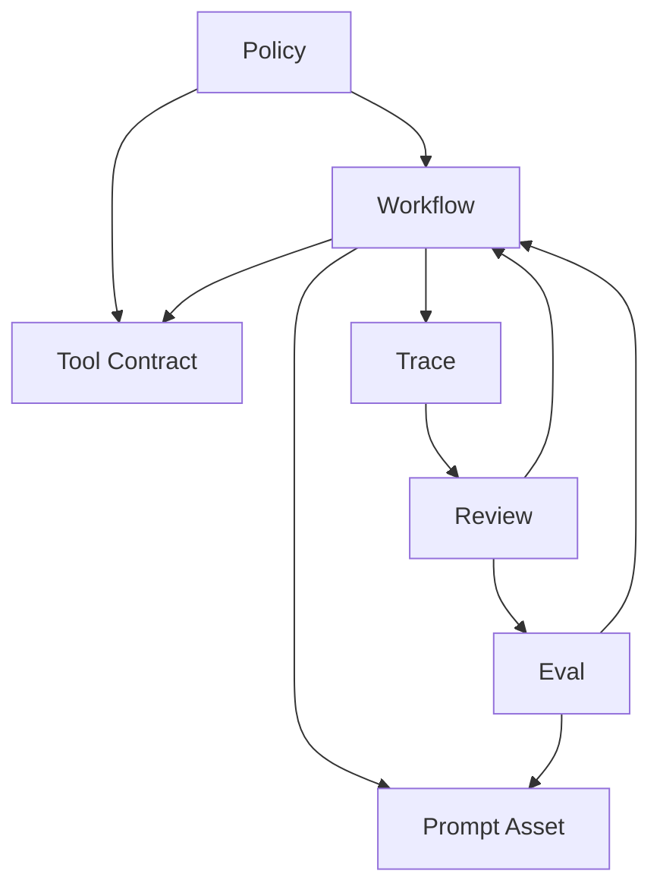

# Object Model

## Purpose

This document defines the core object model for `harness-engineering`.

The repository is not centered on `skills` as its primary abstraction. Instead, it uses a small set of canonical objects that together describe how an agent-oriented system is designed, run, inspected, and improved.

## Primary Objects

### Workflow

Defines the execution structure for a class of task.

Typical concerns:

- task phases
- checkpoints
- handoff points
- tool selection points
- exit conditions

### Prompt Asset

Defines reusable prompt content that should be versioned, reviewed, and referenced explicitly.

Typical concerns:

- intended task
- variables
- assumptions
- allowed or disallowed behaviors

### Tool Contract

Defines the agent-facing contract of a tool.

Typical concerns:

- inputs
- outputs
- error shape
- approval requirement
- safety boundary

### Eval

Defines how quality is judged.

Typical concerns:

- success criteria
- test cases
- grading rubric
- regression expectation
- trace-aware review logic

### Trace

Defines the inspectable record of execution.

Typical concerns:

- workflow steps taken
- prompt assets used
- tool calls made
- intermediate decisions
- failures or deviations

### Policy

Defines system-wide constraints and rules.

Typical concerns:

- approval rules
- repository constraints
- naming and layering rules
- content restrictions

## Relationships



## Harness Loop

The object model is exercised through the repository's standard loop:

```text
Design -> Execute -> Trace -> Evaluate -> Review -> Iterate -> Design
```

### Loop-to-Object Mapping

| Loop Stage | Primary Objects |
|------|------|
| Design | Workflow, Prompt Asset, Tool Contract, Policy |
| Execute | Workflow, Prompt Asset, Tool Contract |
| Trace | Trace |
| Evaluate | Eval, Trace |
| Review | Trace, Eval, Workflow, Tool Contract, Prompt Asset, Policy |
| Iterate | Any object that requires change |

## Why Skill Is Not a Primary Object

In this repository, a skill is an installable interface that routes a user or agent into canonical docs and assets.

A skill may:

- introduce a concept
- guide a workflow
- point to examples
- reference a blueprint template

A skill may not:

- become the sole source of a canonical definition
- silently replace blueprint rules
- redefine the object model

## Object-First Review Rule

When a run fails, the review loop should ask:

1. Was the workflow wrong?
2. Was the prompt asset wrong?
3. Was the tool contract unclear or unsafe?
4. Was the eval too weak or misaligned?
5. Was the policy missing or violated?
6. Did the trace fail to expose the problem?

This repository treats object-level diagnosis as a central harness-engineering discipline.
