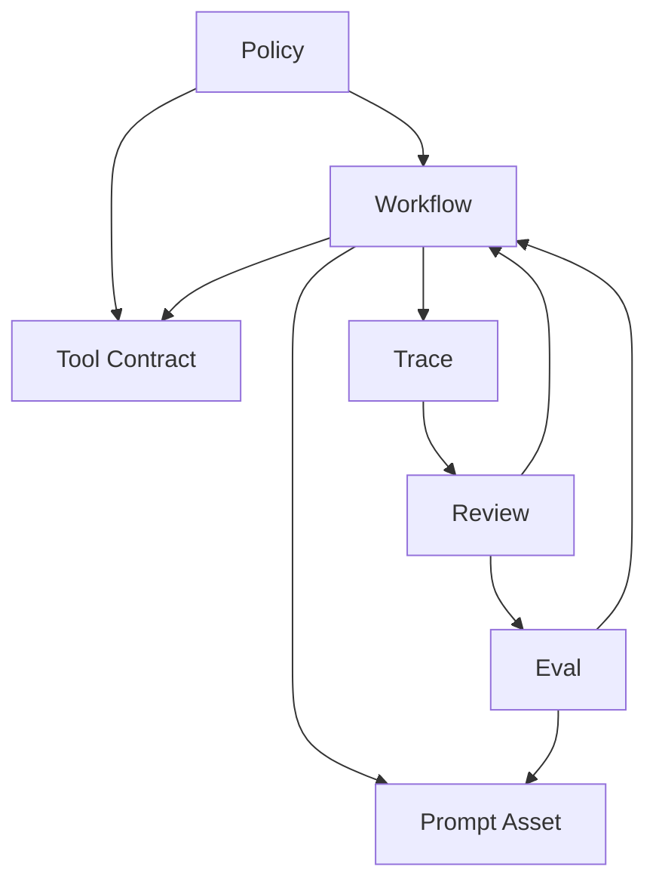

# Harness Blueprint Monorepo Design

Status: Draft for review
Date: 2026-03-31

## 1. Overview

This document defines the first approved design for `harness-engineering`, a public blueprint repository for teaching and packaging harness engineering practices.

The repository is inspired by OpenAI's public harness-engineering direction and Anthropic's public work on context engineering, tool design, evals, subagents, memory, and hooks. It borrows useful ideas from `obra/superpowers`, but it is not a clone and does not use `skills` as its primary architectural abstraction.

The repository is designed as a `Harness Blueprint Monorepo`:

- It teaches harness engineering as a discipline.
- It packages installable skills for Codex via `skill-installer`.
- It treats repository structure, workflow definitions, traces, evals, and review loops as first-class engineering assets.

### 1.1 Goals

- Provide a public, reusable blueprint that others can fork, study, and extend.
- Center the design on `workflow`, `eval`, `trace`, and repository legibility.
- Support both an umbrella skill and focused module skills from the same repository.
- Make the first release teaching-quality, not feature-maximal.

### 1.2 Audience

- Builders who want to understand harness engineering before implementing their own systems.
- Teams that want installable skill entry points tied to canonical docs and templates.
- Practitioners who want examples of how to structure agent-oriented repositories as durable engineering systems.

## 2. Design Principles

### 2.1 Repository as System of Record

Knowledge must live in versioned repository artifacts, not in transient chat history. The repository itself is the agent-readable environment.

### 2.2 Workflow First

The main design center is the execution loop around workflows, prompts, tools, traces, evals, and policies. Skills are entry points into this system, not the system itself.

### 2.3 Installable by Design

The repository must be structured so that `skill-installer` can install either one umbrella skill or focused module skills without ambiguity or path churn.

### 2.4 Pedagogy Before Cleverness

Version 1 should maximize clarity, explicit boundaries, and teachable examples. Complex automation is secondary to a clear mental model.

### 2.5 Inspired, Not Derivative

The repository may learn from `superpowers`, OpenAI, and Anthropic, but its naming, structure, and design contract must remain clearly its own.

## 3. Non-Goals

- Build a complete agent runtime platform in version 1.
- Default to multi-agent orchestration.
- Ship a provider-abstraction layer for every model vendor.
- Turn the repository into a skill marketplace with loose conceptual boundaries.
- Put all important knowledge into one large `AGENTS.md` file.

## 4. Top-Level Repository Architecture

The repository should use the following top-level structure:

```text
harness-engineering/
  AGENTS.md
  README.md
  docs/
    specs/
    concepts/
    architecture/
    workflows/
    tools/
    evals/
    prompts/
    policies/
    examples/
  skills/
    harness-engineering/
    workflow-design/
    prompt-assets/
    tool-contracts/
    eval-design/
    trace-review/
    repo-legibility/
  blueprints/
    workflows/
    tools/
    prompts/
    evals/
    traces/
    policies/
  examples/
    minimal/
    productized/
  references/
    openai/
    anthropic/
  scripts/
  tests/
```

### 4.1 Directory Responsibilities

- `README.md`: public entry point for humans.
- `AGENTS.md`: short routing map for agents.
- `docs/`: canonical definitions, architecture, and teaching material.
- `skills/`: installable skill entry points.
- `blueprints/`: canonical templates and patterns.
- `examples/`: instantiated teaching cases.
- `references/`: external-source mappings and inspiration notes.
- `scripts/` and `tests/`: support utilities and quality checks.

## 5. Canonical Source of Truth

The repository uses four documentation strata:

| Layer | Location | Purpose | May Define Canonical Meaning? |
|------|------|------|------|
| Entry docs | `README.md`, `AGENTS.md` | Orientation and routing | No |
| Canonical concepts | `docs/concepts/`, `docs/architecture/` | Definitions and design rules | Yes |
| Canonical assets | `blueprints/` | Standard object templates and patterns | Yes, for structure |
| Derived surfaces | `skills/`, `examples/`, future automation helpers | Entry flows and demonstrations | No |

The core rule is:

`Definitions live in docs, templates live in blueprints, entry flows live in skills, demonstrations live in examples.`

### 5.1 Anti-Drift Rules

- No duplicate definitions across README, skills, and examples.
- No canonical logic inside skills.
- Examples may simplify, but may not redefine core concepts.

## 6. Core Object Model

The repository defines six primary objects:

### 6.1 Workflow

Defines how a class of task executes: phases, steps, entry conditions, tool use, checkpoints, eval handoff, and exit conditions.

### 6.2 Prompt Asset

Defines reusable, versionable prompt content. Prompt assets are standalone repository objects, not hidden strings in implementation code.

### 6.3 Tool Contract

Defines the agent-facing contract for a tool: inputs, outputs, error cases, safety boundary, and approval expectations.

### 6.4 Eval

Defines how success is measured for a workflow, prompt asset, or tool behavior. Evals include cases, rubric, graders, and regression expectations.

### 6.5 Trace

Defines the inspectable record of an execution. Traces are teaching and review artifacts, not merely debug leftovers.

### 6.6 Policy

Defines cross-cutting system constraints such as approval rules, architectural restrictions, naming rules, and content constraints.

### 6.7 Relationships



`Skill` is intentionally not a top-level object. In this repository, a skill is a distribution and interaction surface over canonical objects.

## 7. Harness Loop

The repository standardizes a six-step harness loop:

```text
Design -> Execute -> Trace -> Evaluate -> Review -> Iterate -> Design
```

### 7.1 Loop Stages

1. `Design`: define workflow, prompt assets, tool contracts, and policies.
2. `Execute`: run the workflow on a real or example task.
3. `Trace`: capture the process, not only the final output.
4. `Evaluate`: judge behavior against explicit success criteria.
5. `Review`: identify which object should change.
6. `Iterate`: change the object model, assets, or guardrails and repeat.

### 7.2 Loop Rules

- No prompt-only optimization for serious system problems.
- No output-only judgment when trace inspection is needed.
- Review should target objects, not symptoms.

## 8. Skills and Distribution

The repository supports two installation patterns:

- Umbrella install via `skills/harness-engineering/`
- Module install via focused skill directories

### 8.1 Umbrella Skill

`skills/harness-engineering/` should:

- introduce the repository's worldview and vocabulary
- route users to canonical docs
- direct users toward the correct module skill for the task
- preserve a unified harness-engineering mental model

### 8.2 Module Skills

Version 1 includes the following modules:

- `workflow-design`
- `prompt-assets`
- `tool-contracts`
- `eval-design`
- `trace-review`
- `repo-legibility`

Each module skill must map back to a canonical blueprint object or harness-loop segment.

### 8.3 Distribution Rules

- Skill directory basenames are public API surface.
- Skill content should reference canonical blueprint assets instead of duplicating them.
- Version 1 is `skill-installer` first, but layout and naming should remain compatible with future plugin packaging.

## 9. Blueprints and Examples

Blueprints and examples serve different roles:

- `Blueprint`: canonical pattern or template.
- `Example`: instantiated teaching case using one or more blueprints.

### 9.1 Blueprint Rules

- Every important blueprint should have at least one example.
- Every example should identify which blueprints it derives from.
- Examples can be more concrete than blueprints, but cannot redefine them.

### 9.2 Example Tracks

The repository should include two example lines:

- `examples/minimal/`: the smallest end-to-end harness loop that remains legible.
- `examples/productized/`: a more layered, team-oriented version showing long-lived repository organization.

Each example should explain:

- the problem
- the harness design
- the trace and review path
- the lesson intended for the reader

## 10. Evals, Traces, and Review Loops

Evals, traces, and reviews are the teaching spine of the repository.

### 10.1 Role Definitions

- `Eval`: defines whether the harness met the goal.
- `Trace`: explains how the result happened.
- `Review`: determines which object should change next.

### 10.2 Key Principle

In harness engineering, traces are first-class learning artifacts.

### 10.3 Required Teaching Pattern

Version 1 examples should include:

- at least one successful flow
- at least one fragile or misleading flow revealed by traces
- at least one eval-driven iteration that improves the design

## 11. Repo Legibility, Policy, and Quality Checks

This repository treats legibility and guardrails as architectural concerns.

### 11.1 Repo Legibility

The repository should optimize for:

- direct discoverability of canonical docs
- stable folder semantics
- explicit mapping from skills to source-of-truth files
- direct access to examples, traces, and eval structure

### 11.2 Policy

Policies define the intended boundaries of the system, such as:

- examples may not redefine canonical concepts
- module skills must map to core objects or harness-loop stages
- canonical meaning lives in docs and blueprints
- risky actions should require explicit review or approval

### 11.3 Quality Checks

Quality checks are the mechanical enforcement layer. Version 1 should define, and later automate, checks for:

- broken internal links or stale references
- missing skill-to-doc mappings
- incomplete blueprint templates
- missing example-to-blueprint traceability
- naming or directory violations

The core principle is:

`Policy defines intent; quality checks enforce it mechanically.`

## 12. Version 1 Scope

Version 1 must include:

1. one umbrella skill
2. six focused module skills
3. canonical docs for concepts and architecture
4. blueprint templates for all core objects, including tool contracts
5. minimal and productized example tracks
6. documented legibility and quality-check design
7. clear `skill-installer` installation paths

Version 1 intentionally excludes:

- a full runtime platform
- complex multi-agent orchestration
- broad provider adapter coverage
- heavy dashboards or UI layers
- a large catalog of unrelated skills

Version 1 ships a teaching-quality harness blueprint, not a full agent platform.

## 13. Future Extensions

Possible future extensions include:

- plugin-compatible packaging beyond `skill-installer`
- more specialized module skills
- stronger repository legibility checks
- richer eval datasets and graders
- provider-specific implementation guides
- optional runtime helpers for executing blueprint examples

## 14. Initial File Set

The design implies the following first canonical files:

- `docs/specs/2026-03-31-harness-blueprint-monorepo-design.md`
- `docs/architecture/repository-map.md`
- `docs/architecture/object-model.md`

These documents define the initial canonical design contract for the repository.
